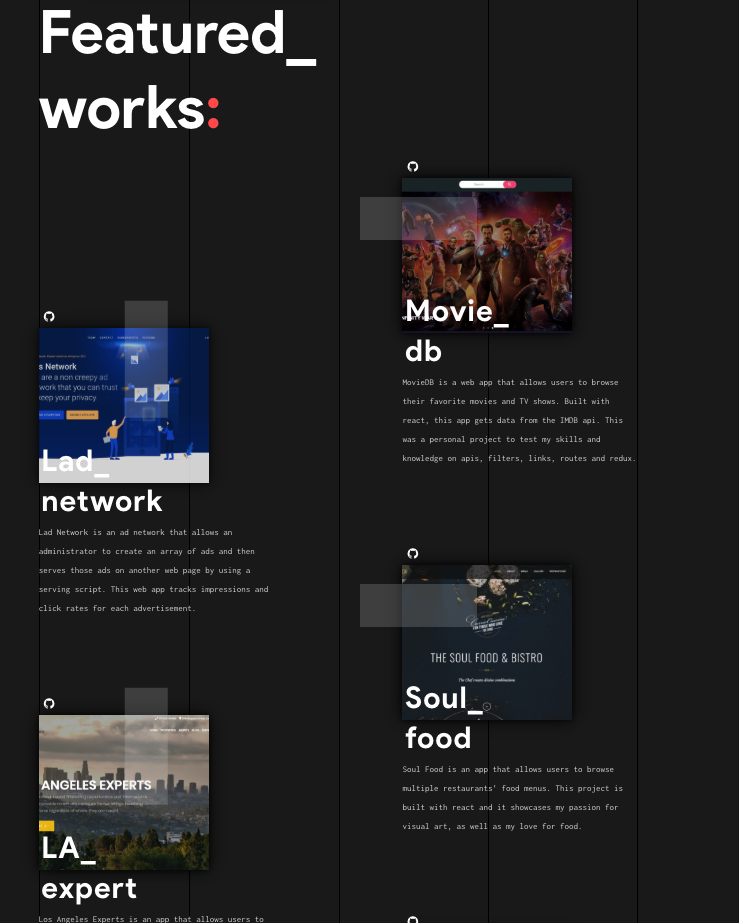

#

<h1 align="center"></h1>

# Personal Portfolio Website

Hello and welcome to my portfolio website that showcases all my recent projects, and shows you what I'm passionate about in life; I like being challenged every day whether that be a simple bug fix, to something big like a new project, The opportunity to be creative with your ideas and Learning something new pretty much every day.

 

 

## Table of Contents

- [Personal Portfolio Website](#personal-portfolio-website)
  - [Table of Contents](#table-of-contents)
  - [Getting Started](#getting-started)
      - [How to run the app](#how-to-run-the-app)
  - [Stack](#stack)
  - [Author](#author)
  - [Acknowledgements](#acknowledgements)

## Getting Started

#### How to run the app
  1. Either fork using [https://github.com/john2796/personal-portfolio.git](https://github.com/john2796/personal-portfolio.git) or download the app and open the folder in the cli
  2. [`yarn install`](https://classic.yarnpkg.com/en/docs/cli/install) :  installs all the dependencies defined in a package.json file. for more information about yarn [click here](https://classic.yarnpkg.com/en/docs/cli/)
  3. run `npm start` or `yarn start` Runs the app in development mode. Open [http://localhost:3000](http://localhost:3000) to view it in the browser.
  This page will automatically reload if you make changes to the code. You will see the build errors and lint warnings in the console.

## Stack

- [React](https://reactjs.org/)
- [prop-types](https://reactjs.org/docs/typechecking-with-proptypes.html)
- [Styled Components](https://www.styled-components.com/)

## Author

- [John Benedict Miranda](https://github.com/john2796)

## Acknowledgements

- Thanks to [Nathan Thomas](http://danielrd.com/) for the readme layout inspiration.

